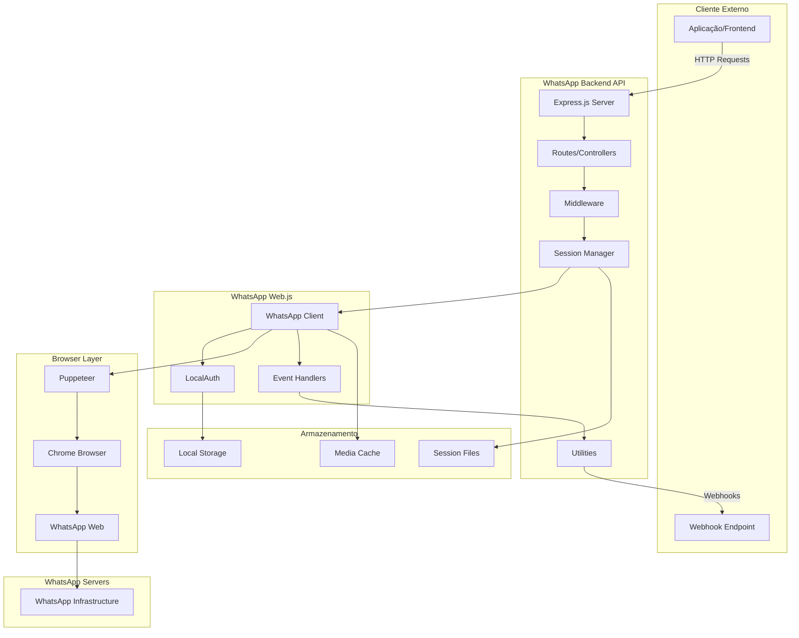
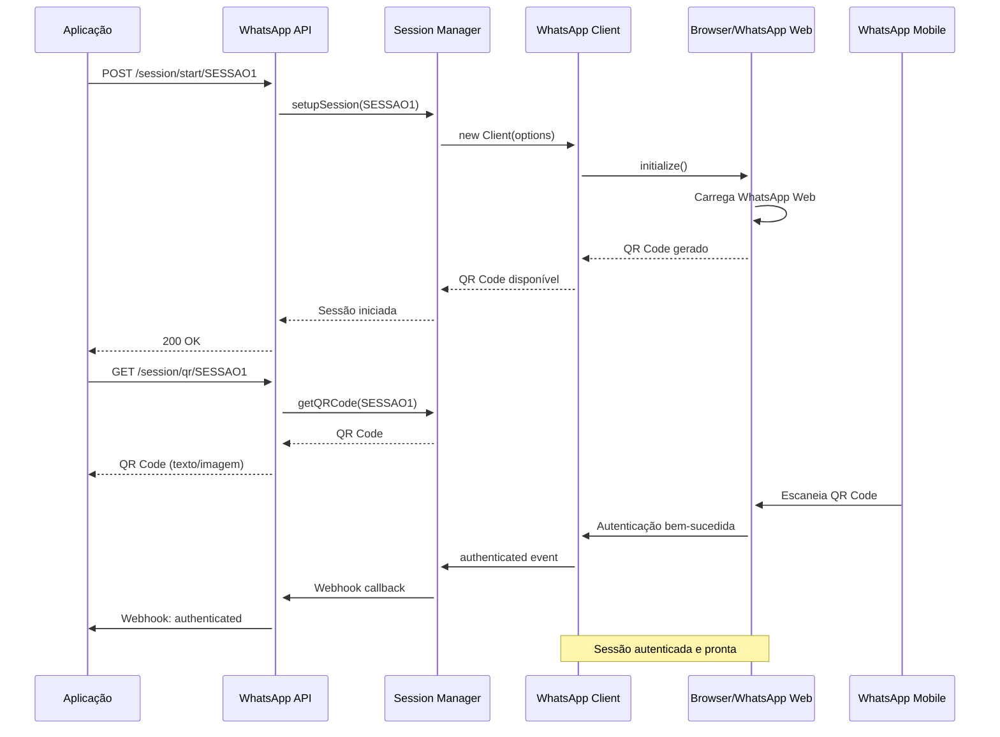
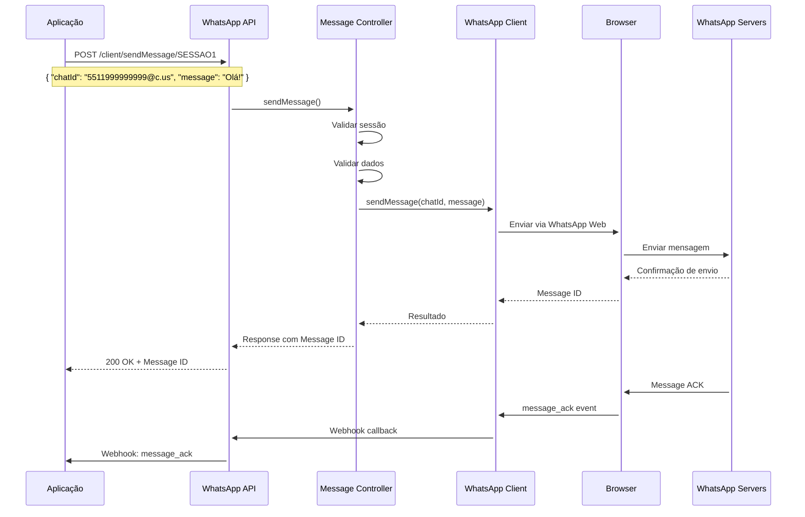
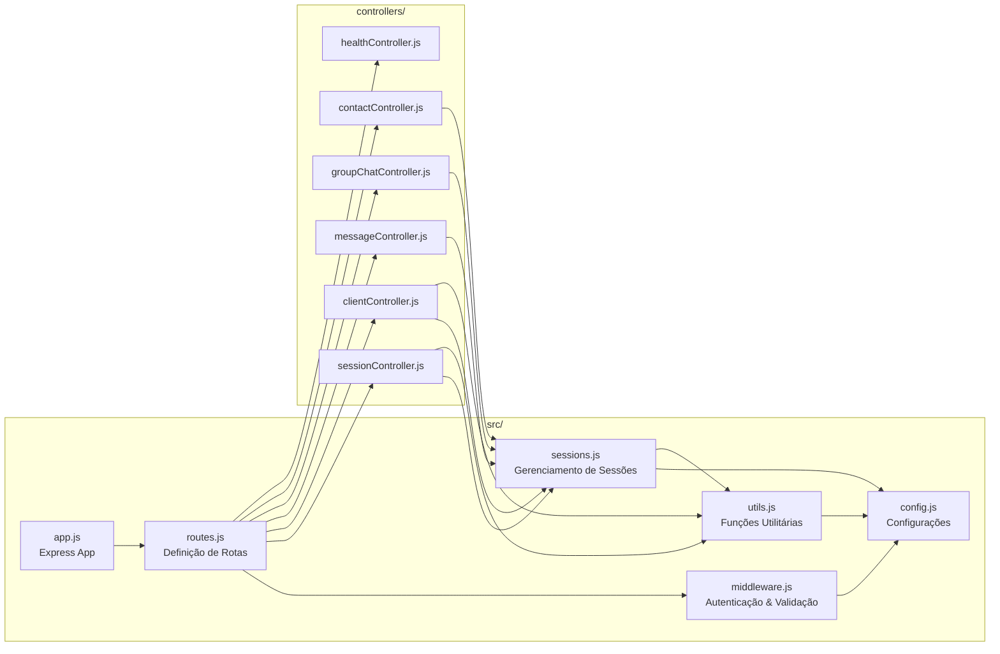
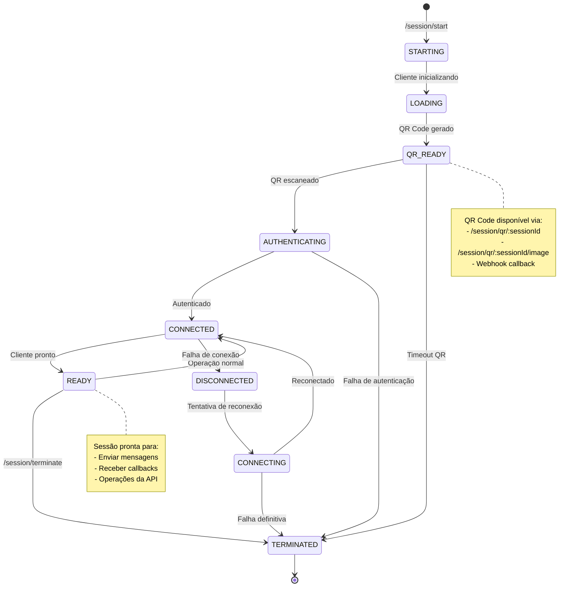

# WhatsApp Backend - Diagramas e Fluxos

## Arquitetura Geral do Sistema



## Fluxo de Autenticação



## Fluxo de Envio de Mensagem



## Estrutura de Componentes



## Estados da Sessão



## Fluxo de Webhooks

```mermaid
graph TD
    subgraph "WhatsApp Client Events"
        QR[qr]
        AUTH[authenticated]
        READY[ready]
        MESSAGE[message]
        MSG_ACK[message_ack]
        CALL[call]
        GROUP[group_join/leave]
    end
    
    subgraph "Event Processing"
        CHECK[checkIfEventEnabled]
        TRIGGER[triggerWebhook]
        HTTP[HTTP POST]
    end
    
    subgraph "Webhook Destinations"
        GLOBAL[BASE_WEBHOOK_URL]
        SESSION[SESSION_WEBHOOK_URL]
        APP[Aplicação Cliente]
    end
    
    QR --> CHECK
    AUTH --> CHECK
    READY --> CHECK
    MESSAGE --> CHECK
    MSG_ACK --> CHECK
    CALL --> CHECK
    GROUP --> CHECK
    
    CHECK --> TRIGGER
    TRIGGER --> HTTP
    
    HTTP --> GLOBAL
    HTTP --> SESSION
    GLOBAL --> APP
    SESSION --> APP
    
    note1[Configuração por variáveis de ambiente:<br/>BASE_WEBHOOK_URL (global)<br/>SESSIONID_WEBHOOK_URL (específica)]
    note2[Callbacks podem ser desabilitados:<br/>DISABLED_CALLBACKS=message_ack|call]
```

---

*Estes diagramas ilustram o funcionamento interno do WhatsApp Backend, mostrando a interação entre componentes e fluxos de dados.*